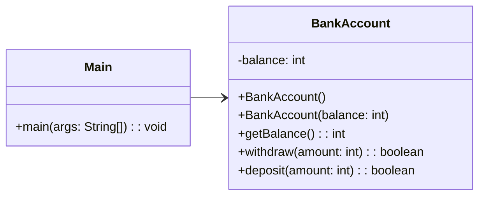
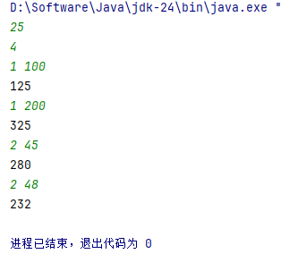
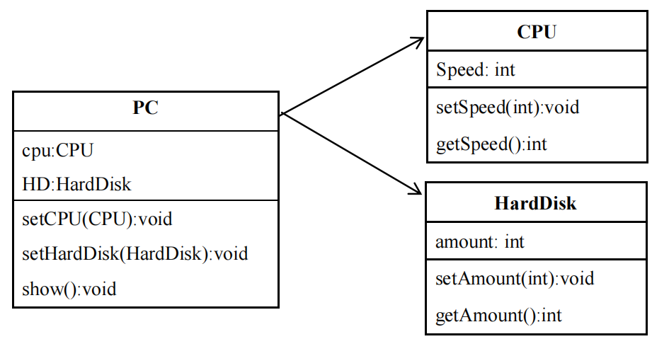
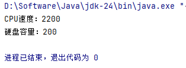
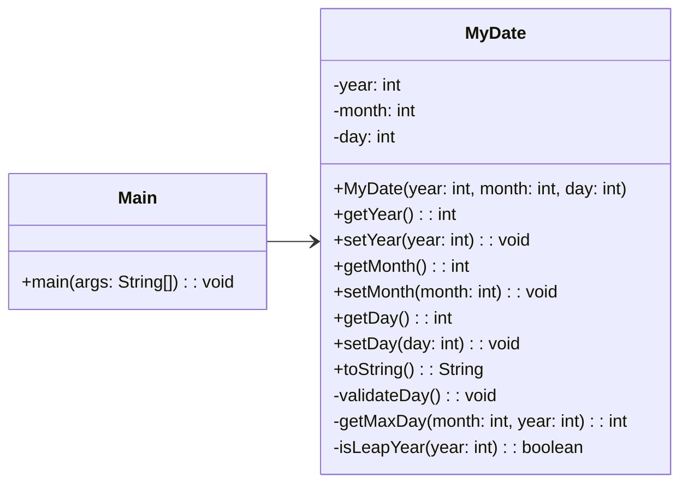
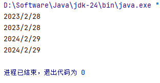
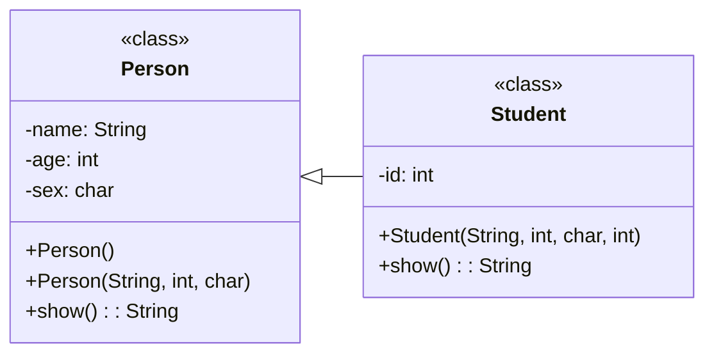
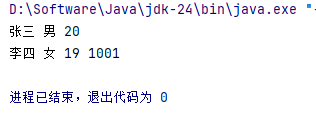
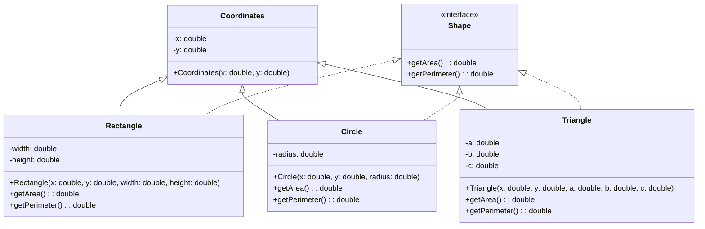
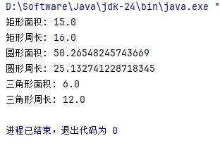

<div class="cover" style="page-break-after:always;font-family:方正公文仿宋;width:100%;height:100%;border:none;margin: 0 auto;text-align:center;">
    </br></br></br></br></br></br></br>
    <div style="width:60%;margin: 0 auto;height:0;padding-bottom:10%;">
        </br>
        
    </div>
    </br></br></br></br></br>
    <p style="font-family:华文中宋;text-align:center;font-size:30pt;margin: 0 auto">本科实验报告 </p>
    </br></br></br></br></br></br></br></br></br>
    <table style="border:none;margin-left:-1%;text-align:center;width:80%;font-family:仿宋;font-size:16px;">
    <tbody style="font-family:方正公文仿宋;font-size:15pt;">
        <tr style="font-weight:normal;"> 
            <td style="width:20%;text-align:right;">课程名称</td>
            <td style="width:2%">：</td> 
            <td style="width:30%;font-weight:normal;border-bottom: 1px solid;text-align:center;font-family:华文仿宋"> Java程序设计</td>     </tr>
        <tr style="font-weight:normal;"> 
            <td style="width:20%;text-align:right;">姓　　名</td>
            <td style="width:2%">：</td> 
            <td style="width:30%;font-weight:normal;border-bottom: 1px solid;text-align:center;font-family:华文仿宋"> 唐镇邦</td>     </tr>
        <tr style="font-weight:normal;"> 
            <td style="width:20%;text-align:right;">学　　院</td>
            <td style="width:2%">：</td> 
            <td style="width:30%;font-weight:normal;border-bottom: 1px solid;text-align:center;font-family:华文仿宋"> 人工智能与数据科学学院</td>     </tr>
        <tr style="font-weight:normal;"> 
            <td style="width:20%;text-align:right;">专　　业</td>
            <td style="width:2%">：</td> 
            <td style="width:30%;font-weight:normal;border-bottom: 1px solid;text-align:center;font-family:华文仿宋"> 人工智能</td>     </tr>
        <tr style="font-weight:normal;"> 
            <td style="width:20%;text-align:right;">学　　号</td>
            <td style="width:2%">：</td> 
            <td style="width:30%;font-weight:normal;border-bottom: 1px solid;text-align:center;font-family:华文仿宋">230121 </td>     </tr>
        <tr style="font-weight:normal;"> 
            <td style="width:20%;text-align:right;">指导教师</td>
            <td style="width:2%">：</td> 
            <td style="width:30%;font-weight:normal;border-bottom: 1px solid;text-align:center;font-family:华文仿宋">吕华 </td>     </tr>
    </tbody>              
    </table>
	</br></br></br></br>
	<p style="text-align:center;font-size:17pt;margin: 0 auto;font-family:华文仿宋">2025 年 4 月 24 日 </p>                       
	</br></br></br></br></br></br></br>
</div>
<!-- 注释语句：导出PDF时会在这里分页 -->

<!-- 
    flex: [flex-grow] [flex-shrink] [flex-basis] 
    flex: none(0, 0, auto), auto(1, 1, auto), initial(0, 1, auto)
    有需要可以自行调整 
-->

**目录**

[TOC]


# 实验一 面向对象编程基础

## 实验目的

​	通过编程和上机实验，掌握 Java 语言的基本语法、基本数据类型的使用方法，掌握从键盘输入基本类型的数据，熟练运用分支、循环等语句控制程序流程。掌握类和构造方法的定义及创建对象的方法，掌握类的封装及继承原则，正确使用重载和覆盖等多态概念设计可复用方法，掌握面向对象的程序设计方法。

## 实验内容

### BankAccount 类的设计

#### 题目

1. 设计一个 BankAccount 类，这个类包括：
   1. 一个 int 型的 balance 表示账户余额。
   2. 一个无参构造方法，将账户余额初始化为 0。
   3. 一个带一个参数的构造方法，将账户余额初始化为该输入的参数。
   4. 一个 getBlance()方法，返回账户余额。
   5. 一个 withdraw()方法：带一个 amount 参数，并从账户余额中提取 amount 指定的款额。
   6. 一个 deposit()方法：带一个 amount 参数，并将 amount 指定的款额存储到该银行账户上。

​	提供 main 函数，构造一个账户对象，并对其进行存取款操作。

​	其中操作类型为 1 表示存款，2 表示取款，每次操作后都打印余额。

#### 设计思路

采用面向对象的方式设计BankAccount类，封装账户余额及相关操作。BankAccount类包含一个int型成员变量balance表示余额，提供无参构造方法初始化余额为0和带参构造方法自定义初始余额。通过getBalance()方法获取当前余额，withdraw()方法处理取款操作（需验证金额有效性），deposit()方法处理存款操作（需验证金额有效性）。主类Main通过Scanner接收用户输入，根据操作类型（1存款/2取款）调用相应方法，并在每次操作后输出余额。若操作失败（如金额非法）则提示错误信息。



#### 源代码

1. **Main.java**

   ```java
   import java.util.Scanner;
   
   public class Main {
       public static void main(String[] args) {
           Scanner scanner = new Scanner(System.in);
           int balance = scanner.nextInt();
           BankAccount bankAccount = new BankAccount(balance);
           
           int transactionCount = scanner.nextInt();
           for (int i = 0; i < transactionCount; i++) {
               int transactionType = scanner.nextInt();
               int amount = scanner.nextInt();
               
               boolean success;
               switch (transactionType) {
                   case 1:  // 存款
                       success = bankAccount.deposit(amount);
                       if (!success) {
                           System.out.println("请检查金额");
                           return;
                       }
                       break;
                   case 2:  // 取款
                       success = bankAccount.withdraw(amount);
                       if (!success) {
                           System.out.println("请检查金额");
                           return;
                       }
                       break;
                   default:
                       System.out.println("模式错误");
                       return;
               }
               
               System.out.println(bankAccount.getBalance());
           }
           
           scanner.close();
       }
   }
   ```

2. **BankAccount.java**

   ```java
   public class BankAccount{
       int balance;
   
       protected BankAccount(){balance = 0;}
       protected  BankAccount(int balance){this.balance = balance;}
   
       public int getBalance() {return balance;}
   
       public boolean withdraw(int amount){
           if(amount <= 0 || amount > balance) return false;
           balance -= amount;
           return true;
       }
   
       public boolean deposit(int amount){
           if(amount <= 0) return false;
           balance += amount;
           return true;
       }
   }
   ```

#### 实验结果



#### 结果分析

代码运行结果符合预期，达到了代码设计中的要求，很好的完成了四次存取款的操作。


### 计算机中的CPU与硬盘

#### 题目

用类描述计算机中 CPU 的速度和硬盘的容量，要求 Java 应用程序有 4个类，名字分别是 PC、CPU、HardDisk 和 Test，其中 Test 是主类。PC 类与 CPU类和 HardTest 类关联的 UML 图如下图所示。



  <p style="text-align: center; font-style: italic; margin-top: 5px;">图1：PU与关联类的UML图示</p>

  其中：
  - CPU 类要求 getSpeed()返回 speed 的值，要求 setSpeed(int m)方法将参数 m 的值赋给 speed；
  - HardDisk 类要求 getAmount()返回 amount 的值，setAmount(int m)方法将参数 m 的值赋给 amount；
  - PC 类要求 setCPU(CPU c)将参数c的值赋给cpu，setHardDisk(HardDisk h)方法将参数h的值赋给HD，show()方法显示 CPU 的速度和硬盘的容量。

  主类 Test 的要求如下：

+ 在 main()方法中创建一个 CPU 对象 cpu，将 speed 设置为 2200；

+ 在 main()方法中创建一个 HardDisk 对象 disk，将容量 ammount 设置为 200；

+ 在 main()方法中创建一个 PC 对象 PC；

+ pc 调用 setCPU(CPU c)方法，调用时实参是 cpu；

+ pc 调用 setHardDisk(HardDisk h)方法，调用时实参是 disk；

+ pc 调用 show()方法显示 CPU 的速度和硬盘的容量。


#### 设计思路

采用类之间的关联关系实现计算机配置信息的描述，定义了四个类CPU、HardDisk（HD）、PC和Test。其中CPU类负责处理CPU速度的获取和设置，HardDisk类负责处理硬盘容量的获取和设置，PC类通过组合方式关联CPU和HardDisk类并展示配置信息。主类Test中创建CPU和HardDisk对象并设置参数，然后通过PC类整合并显示计算机的配置信息。

#### 源代码

1. **Test.java**

   ```java
   public class Test {
       public static void main(String[] args){
           CPU cpu = new CPU();
           cpu.setSpeed(2200);
           HD hd = new HD();
           hd.setAmount(200);
           PC pc = new PC(cpu,hd);
           pc.show();
       }
   }
   
   ```

2. **PC.java**

   ```java
   public class PC {
       CPU cpu;
       HD hd;
   
       public void setCPU(CPU cpu){
           this.cpu = cpu;
       }
       public void setHd(HD hd){
           this.hd = hd;
       }
       public PC(CPU cpu,HD hd){
           setCPU(cpu);
           setHd(hd);
       }
       public void show(){
           System.out.print("CPU速度：");
           System.out.print(cpu.getSpeed());
           System.out.println();
           System.out.print("硬盘容量：");
           System.out.print(hd.getAmount());
           System.out.println();
       }
   
   }
   
   ```

3. **CPU.java**

   ```java
   public class CPU {
       int Speed;
       public void setSpeed(int Speed){
           this.Speed = Speed;
       }
       public int getSpeed(){
           return Speed;
       }
   }
   
   ```

4. **HD.java**

   ```java
   public class HD {
       int amount;
       public void setAmount(int amount){
           this.amount = amount;
       }
       public int getAmount(){
           return amount;
       }
   }
   ```

#### 实验结果



#### 结果分析

代码运行结果符合预期，达到了代码设计中的要求，完成了对CPU速度和磁盘容量的写入和展示。

### 日期类

#### 题目

构造日期类 MyDate 类，包含年月日，提供相应的 get 和 set 函数，设置日期时能实现日期合法性判断，包括大小月和闰年。可以利用 MyDate 类的toString()方法来实现类对象属性的展示，以“\*\*\*\*/*/**”的格式显示日期，例：2022/8/29。

#### 设计思路

采用面向对象的方式设计MyDate类，封装日期数据及相关操作。MyDate类包含三个私有成员变量year、month、day分别表示年、月、日。提供getter和setter方法访问和修改日期，其中setter方法需要进行日期合法性验证，包括检查月份是否在1-12范围内，天数是否在当前月份的有效范围内（考虑大小月和闰年二月的情况）。toString()方法按照"\*\*\*\*/*/**"格式返回日期字符串。辅助方法isLeapYear()判断闰年，getMaxDay()获取指定月份的最大天数。主类Main演示MyDate类的使用，创建对象并测试日期设置和显示功能。



#### 源代码

1. Main.java
```java
public class Main {
    public static void main(String[] args) {
        MyDate date1 = new MyDate(2023, 2, 28);
        System.out.println(date1.toString()); // 2023/2/28
        
        date1.setDay(29); // 无效设置，2023不是闰年
        System.out.println(date1.toString()); // 仍为2023/2/28
        
        MyDate date2 = new MyDate(2024, 2, 28); // 2024是闰年
        date2.setDay(29); // 有效设置
        System.out.println(date2.toString()); // 2024/2/29
        
        date2.setMonth(13); // 无效月份
        System.out.println(date2.toString()); // 仍为2024/2/29
    }
}
```

2. MyDate.java
```java
public class MyDate {
    private int year;
    private int month;
    private int day;
    
    public MyDate(int year, int month, int day) {
        setYear(year);
        setMonth(month);
        setDay(day);
    }
    
    public int getYear() {
        return year;
    }
    
    public void setYear(int year) {
        this.year = year;
        validateDay(); 
    }
    
    public int getMonth() {
        return month;
    }
    
    public void setMonth(int month) {
        if (month >= 1 && month <= 12) {
            this.month = month;
            validateDay(); 
        }
    }
    
    public int getDay() {
        return day;
    }
    
    public void setDay(int day) {
        this.day = day;
        validateDay();
    }
    
    private void validateDay() {
        int maxDay = getMaxDay(month, year);
        if (day < 1 || day > maxDay) {
            day = Math.min(Math.max(1, day), maxDay); 
        }
    }
    
    private int getMaxDay(int month, int year) {
        switch (month) {
            case 4: case 6: case 9: case 11:
                return 30;
            case 2:
                return isLeapYear(year) ? 29 : 28;
            default:
                return 31;
        }
    }
    
    private boolean isLeapYear(int year) {
        return (year % 4 == 0 && year % 100 != 0) || (year % 400 == 0);
    }
    
    @Override
    public String toString() {
        return year + "/" + month + "/" + day;
    }
}

```

#### 实验结果



#### 结果分析

代码运行结果符合预期，达到了代码设计中的要求，识别了非法日期，且可以将日期结构化输出。

### Person 类及其子类 Student 类

#### 题目

实现 Person 类及其子类 Student 类。

1. 声明 Person 类，包含 name（String 类型）、age(int 类型)、sex（char类型）成员变量，通过构造方法进行赋值（含构造方法重载）。一个 show 方法，返回类型为 String 类型，返回内容为：姓名 性别 年龄。
2. 声明 Student 类，继承 Person 类，增加学号 id（int 类型）成员变量，通过构造方法，利用 super 调用父类构造方法实现成员变量赋值。Override父类的 show 方法，返回 String 类型，返回内容为：姓名 性别 年龄 学号。

#### 设计思路

设计Person类及其子类Student类，采用面向对象的方式实现继承和方法重写。Person类包含三个成员变量：name（String类型）、age（int类型）和sex（char类型），提供构造方法重载（无参构造方法和带参构造方法）进行变量初始化，并定义show方法返回格式化的个人信息。Student类继承Person类，新增id（int类型）成员变量表示学号，通过构造方法利用super调用父类构造方法完成初始化，并重写show方法以包含学号信息。通过继承机制，Student类复用Person类的属性和方法，同时扩展自己的特性，体现了面向对象的继承和多态特性。主类Main可创建Person和Student对象并调用show方法验证功能。



#### 源代码

1. Person.java
```java
public class Person {
    protected String name;
    protected int age;
    protected char sex;

    public Person() {
        this("", 0, ' ');
    }
    
    public Person(String name, int age, char sex) {
        this.name = name;
        this.age = age;
        this.sex = sex;
    }
    
    public String show() {
        return name + " " + sex + " " + age;
    }
}
```
2. Student.java
```java
public class Student extends Person {
    private int id;

    public Student(String name, int age, char sex, int id) {
        super(name, age, sex);
        this.id = id;
    }
    
    @Override
    public String show() {
        return super.show() + " " + id;
    }
}
```
3. Main.java
```java
public class Main {
    public static void main(String[] args) {
        Person person = new Person("张三", 20, '男');
        System.out.println(person.show());

        Student student = new Student("李四", 19, '女', 1001);
        System.out.println(student.show());
    }
}
```

#### 实验结果



#### 结果分析

代码运行结果符合预期，达到了代码设计中的要求，实现了Person类及其子类Student类。


### 图形类

#### 题目

定义接口 Shape 及其抽象方法 getArea()和 getPerimeter()用于计算图形和面积和周长。定义类 Rectangle(矩形)、类 Circle(圆形)、类 Triangle(三角形)，要求这些类继承点类 Coordinates()并实现接口的抽象方法。

#### 实验思路

采用面向对象的设计方法，首先定义Shape接口，包含计算面积和周长两个抽象方法。然后创建Coordinates类作为基类，表示图形的位置坐标，**为了保证取值合法，将参考中点类x、y的int型修改为了double型。**Rectangle、Circle和Triangle类继承Coordinates类并实现Shape接口，分别实现各自的计算逻辑。Rectangle类需要长宽属性，使用长×宽计算面积，(长+宽)×2计算周长；Circle类需要半径属性，使用π×半径²计算面积，2×π×半径计算周长；Triangle类需要三边长度属性，使用海伦公式计算面积，三边之和计算周长。每个类都通过构造函数初始化必要参数，并在方法中验证参数有效性。主类Main可以创建不同图形对象并调用接口方法输出结果。



#### 源代码


1. Shape.java
```java
public interface Shape {
    double getArea();
    double getPerimeter();
}
```

2. Coordinates.java
```java
public class Coordinates {
    protected double x;
    protected double y;
    
    public Coordinates(double x, double y) {
        this.x = x;
        this.y = y;
    }
}
```

3. Rectangle.java
```java
public class Rectangle extends Coordinates implements Shape {
    private double width;
    private double height;
    
    public Rectangle(double x, double y, double width, double height) {
        super(x, y);
        if (width <= 0 || height <= 0) {
            throw new IllegalArgumentException("宽度和高度必须为正数");
        }
        this.width = width;
        this.height = height;
    }
    
    @Override
    public double getArea() {
        return width * height;
    }
    
    @Override
    public double getPerimeter() {
        return 2 * (width + height);
    }
}
```

4. Circle.java
```java
public class Circle extends Coordinates implements Shape {
    private double radius;
    
    public Circle(double x, double y, double radius) {
        super(x, y);
        if (radius <= 0) {
            throw new IllegalArgumentException("半径必须为正数");
        }
        this.radius = radius;
    }
    
    @Override
    public double getArea() {
        return Math.PI * radius * radius;
    }
    
    @Override
    public double getPerimeter() {
        return 2 * Math.PI * radius;
    }
}
```

5. Triangle.java
```java
public class Triangle extends Coordinates implements Shape {
    private double a;
    private double b;
    private double c;
    
    public Triangle(double x, double y, double a, double b, double c) {
        super(x, y);
        if (a <= 0 || b <= 0 || c <= 0) {
            throw new IllegalArgumentException("边长必须为正数");
        }
        if (a + b <= c || a + c <= b || b + c <= a) {
            throw new IllegalArgumentException("无效的三角形边长");
        }
        this.a = a;
        this.b = b;
        this.c = c;
    }
    
    @Override
    public double getArea() {
        double s = (a + b + c) / 2;
        return Math.sqrt(s * (s - a) * (s - b) * (s - c));
    }
    
    @Override
    public double getPerimeter() {
        return a + b + c;
    }
}
```

6. Main.java
```java
public class Main {
    public static void main(String[] args) {
        Rectangle rect = new Rectangle(0, 0, 5, 3);
        System.out.println("矩形面积: " + rect.getArea());
        System.out.println("矩形周长: " + rect.getPerimeter());
        
        Circle circle = new Circle(1, 1, 4);
        System.out.println("圆形面积: " + circle.getArea());
        System.out.println("圆形周长: " + circle.getPerimeter());
        
        Triangle triangle = new Triangle(2, 2, 3, 4, 5);
        System.out.println("三角形面积: " + triangle.getArea());
        System.out.println("三角形周长: " + triangle.getPerimeter());
    }
}
```

#### 实验结果



#### 结果分析

代码运行结果符合预期，达到了代码设计中的要求，并将结果按照预期输出了出来。为了保证代码的泛用性，这里将点的坐标改为了double型，代码能很好的运行。


